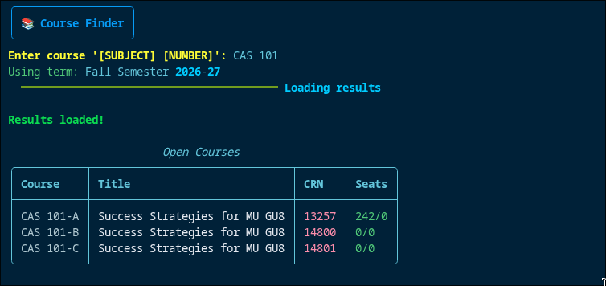

# Miami University Course Finder

A small terminal app for checking Miami University course availability from the command line.



## What It Does

- Opens the Miami University course list in a browser
- Selects the Oxford campus automatically
- Chooses the next available term
- Filters by subject and course number
- Prints the open sections in a clean table

## Requirements

- Python 3.10 or newer
- A Chromium browser for Playwright

## Installation

```bash
pip install -r requirements.txt
playwright install chromium
```

## Usage

Run the script:

```bash
python main.py
```

When prompted, enter a course in this format:

```text
SUBJECT NUMBER
```

Examples:

- `CSE 174`
- `MTH 151`
- `ENG 111`

## How It Works

The script:

1. Opens the Miami University course list page
2. Sets the campus to Oxford
3. Picks the next term from the available term list
4. Searches for the subject and course number you entered
5. Displays only sections with seats remaining

## Notes

- The browser is launched in visible mode (`headless=False`), so you can watch the search happen.
- If no open sections are found, the app prints a short message instead of a table.
- The term selection is inferred from the current date and the options available on the course list page.
